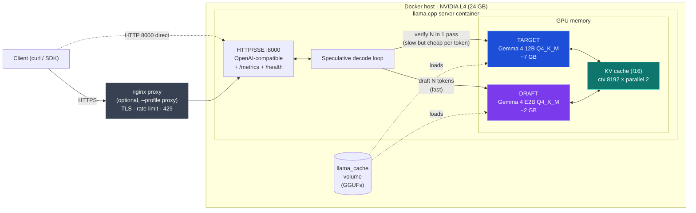
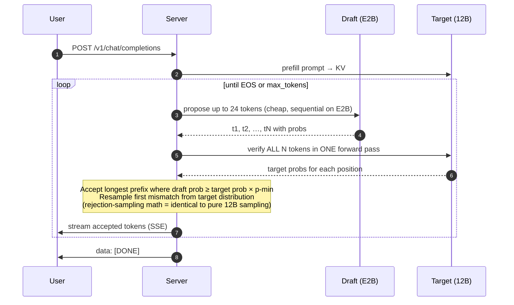

# gemma4-24gb

Gemma 4 12B on a single 24GB GPU (NVIDIA L4) via **llama.cpp** + Docker. Tuned for low-latency interactive use with **speculative decoding** (Gemma 4 E2B draft). Serves `bartowski/gemma-4-12B-it-GGUF:Q4_K_M`.

vLLM is the original target but blocked by an upstream Gemma 4 bug ([details](./ARCHITECTURE.md#vllm-alt-backend-blocked)). Compose preserved as `docker-compose.vllm.yml` for when fixed.

Deep dives: [ANALYSIS.md](./ANALYSIS.md) (decision rationale), [ARCHITECTURE.md](./ARCHITECTURE.md) (system + concurrency math).

## Architecture



### Speculative decoding loop (how 12B and E2B interact)



**Why this is faster:** plain decode = 1 token per 12B forward pass. With spec decode, one 12B pass verifies many tokens at once. Memory-bandwidth-bound 12B reads weights once for N tokens instead of N times. On L4: 28.85 → 79.8 t/s, ~85% accept rate.

**Why output stays identical:** rejection-sampling (Leviathan et al. 2022) guarantees the accepted-token distribution matches what pure 12B would have produced. Draft is a speed hint, never a quality compromise.

## Performance

Measured on NVIDIA L4 (24GB), Q4_K_M, single user, `enable_thinking: false`:

| Config | Decode t/s | 200-tok query |
|--------|-----------:|--------------:|
| Baseline (no spec decode) | 28.85 | ~7.0s |
| **+ speculative decoding (E2B draft)** | **79.8** | **~2.5s** |

**2.77x speedup. Output identical to pure 12B** — rejection sampling proves distributional equivalence.

Spec decode accept rate: ~85% (181/216 tokens) on factual/counting tasks. Repetitive/templated output approaches 100%.

## Prereqs

- NVIDIA GPU with 24GB+ VRAM (L4, A10G, RTX 4090, A100...)
- NVIDIA driver ≥525, CUDA ≥12.1
- Docker ≥24.x + Docker Compose v2
- NVIDIA Container Toolkit installed
- HuggingFace account + Gemma 4 license accepted at https://huggingface.co/google/gemma-4-12B-it
- HF token (read scope) from https://huggingface.co/settings/tokens
- ~30GB free disk (~7.5GB Q4_K_M target + ~2GB E2B draft + cache headroom)

Verify GPU toolkit:
```bash
docker run --rm --gpus all nvidia/cuda:12.1.0-base-ubuntu22.04 nvidia-smi
```

## Run

```bash
cp .env.example .env             # paste HF_TOKEN + generate LLAMA_API_KEY
docker compose up -d             # llama only — exposed on http://localhost:8000
docker compose logs -f llama     # cold start ~5-10min (GGUF downloads)
```

Wait for `server is listening on http://0.0.0.0:8000`.

Optional bundled nginx proxy (TLS + rate limit + 429 backpressure) — see [Reverse proxy](#reverse-proxy-tls--rate-limit--backpressure-optional). Most deploys already terminate TLS upstream; skip if you have your own ingress.

## Verify

```bash
curl http://localhost:8000/health

curl -H "Authorization: Bearer $LLAMA_API_KEY" http://localhost:8000/v1/models
```

Via bundled nginx proxy (if enabled, see [below](#reverse-proxy-tls--rate-limit--backpressure-optional)):
```bash
curl -k https://localhost/health
curl -k -H "Authorization: Bearer $LLAMA_API_KEY" https://localhost/v1/models
```

## Use

```bash
pip install -r requirements.txt
set -a; source .env; set +a
python main.py
python main.py "Write a haiku about quantization."
```

## Configuration knobs

Current config in `docker-compose.yml`:

| Flag | Value | Purpose |
|------|-------|---------|
| `--ctx-size` | 8192 | Total KV budget across slots |
| `--parallel` | 2 | Concurrent request slots |
| `--batch-size` / `--ubatch-size` | 2048 / 2048 | Prefill chunking |
| `--cache-type-k` / `-v` | f16 / f16 | KV cache precision |
| `--flash-attn` | on | Fused attention kernel |
| `-hfd` | `unsloth/gemma-4-E2B-it-GGUF:Q4_K_M` | Draft model |
| `--spec-type` | `draft-simple` | Speculative strategy |
| `--spec-draft-n-max` | 24 | Max draft tokens per step |
| `--spec-draft-n-min` | 4 | Min draft tokens per step |
| `--spec-draft-p-min` | 0.4 | Reject low-confidence drafts |
| `--reasoning-format` | `deepseek` | Parse `<think>` → `reasoning_content` field |
| `--reasoning-budget` | 256 | Cap thinking tokens (-1 = unlimited, 0 = disable) |

## Speculative decoding

Two models loaded:
- **Target**: Gemma 4 12B Q4_K_M (final output, never bypassed)
- **Draft**: Gemma 4 E2B Q4_K_M (~2B params, proposes tokens fast)

Per decode step: draft proposes N tokens → target verifies in one parallel forward pass → accepts matching prefix → resamples on first mismatch. Output distribution provably identical to pure 12B sampling (Leviathan et al. 2022). Quality unchanged.

VRAM cost: ~2GB for draft. Fits comfortably in 24GB after KV.

To disable spec decode, remove all `--spec-*` flags + `-hfd` line and restart.

## Reasoning mode

Gemma 4 has built-in thinking. Server flags expose it via OpenAI-compatible API:

**Enabled by default** with 256-token budget. Response gains `reasoning_content` field:
```json
{
  "choices": [{
    "message": {
      "role": "assistant",
      "reasoning_content": "<think trace>",
      "content": "<final answer>"
    }
  }]
}
```

**Disable per request** for fast simple queries:
```json
{
  "model": "gemma-4-12b",
  "messages": [...],
  "chat_template_kwargs": {"enable_thinking": false}
}
```

**Disable globally**: set `--reasoning-budget 0` in compose.

Route easy/hard queries to different budgets for best latency.

## Reverse proxy (TLS + rate limit + backpressure) — optional

Skip this section if you already have an ingress (nginx, Caddy, ALB, Cloudflare, etc.) in front. The bundled proxy is opt-in via Docker Compose profile so it never starts unless you ask for it.

```bash
./nginx/gen-certs.sh                          # self-signed TLS for dev
docker compose --profile proxy up -d          # llama + nginx
```

Once running: HTTPS on `:443`, HTTP redirect on `:80`. To shut just the proxy: `docker compose --profile proxy stop proxy`.

What it does: single endpoint, TLS, per-IP and per-API-key rate limits, concurrency cap, retry across replicas. Config in `nginx/nginx.conf`.

| Concern | How it's handled |
|---------|------------------|
| TLS termination | HTTPS on :443, redirect from :80. Self-signed via `gen-certs.sh` (swap for Let's Encrypt / ACM in prod). |
| Per-IP rate limit | 30 req/min sustained, burst 10. `429` on exceed. |
| Per-key rate limit | 120 req/min per `Authorization: Bearer …` value, burst 40. |
| Concurrency cap | 8 in-flight per IP → `429` overflow. |
| Backpressure | `429` returned to client (configurable burst). |
| Upstream retry | 502/503/504 retried to another replica. `429` NOT retried (would loop). |
| Streaming | `proxy_buffering off` — SSE tokens flow unbuffered. 600s timeout. |
| Metrics auth | `/metrics` IP-allowlisted to RFC1918 private ranges; tighten for your VPC. |

Tune limits by editing `limit_req_zone` rates + `limit_conn` burst in `nginx/nginx.conf`. JSON access logs include `limit_status` so you can see what got throttled.

## Scaling to multiple replicas

To run multiple llama replicas behind the bundled proxy, edit `docker-compose.yml`:

1. Remove `container_name: gemma4-12b`
2. Replace `ports: ["8000:8000"]` with `expose: ["8000"]`

Then:
```bash
docker compose --profile proxy up -d --scale llama=2
```

Nginx discovers replicas via Docker DNS (`server llama:8000 resolve`); new replicas join the pool live.

**GPU constraint:** each llama replica needs its own GPU. 12B Q4_K_M + E2B draft + KV ≈ 14GB → won't fit two on a single 24GB L4. Multi-replica requires:
- Multi-GPU host (e.g. `g6.12xlarge` = 4× L4), or
- Multi-host swarm/k8s with one GPU per node

For single-GPU hosts, keep `N=1`.

## Streaming

Supported per-request via `"stream": true`. SSE format.

```bash
curl -N -s http://localhost:8000/v1/chat/completions \
  -H "Authorization: Bearer $LLAMA_API_KEY" \
  -H "Content-Type: application/json" \
  -d '{
    "model":"gemma-4-12b",
    "messages":[{"role":"user","content":"Count to 50"}],
    "max_tokens":300,
    "stream":true,
    "stream_options":{"include_usage":true},
    "chat_template_kwargs":{"enable_thinking":false}
  }'
```

**OpenAI SDK:**
```python
from openai import OpenAI
client = OpenAI(base_url="http://localhost:8000/v1", api_key=API_KEY)
stream = client.chat.completions.create(
    model="gemma-4-12b",
    messages=[{"role":"user","content":"Hi"}],
    stream=True,
    extra_body={"chat_template_kwargs":{"enable_thinking":False}}
)
for chunk in stream:
    print(chunk.choices[0].delta.content or "", end="", flush=True)
```

Reasoning content arrives in separate deltas before final answer.

## Tuning for your hardware

Defaults target L4 (24GB, ~300 GB/s bandwidth). Decode is memory-bandwidth-bound on Q4 12B.

| GPU | Expected baseline | Expected with spec decode |
|-----|------------------:|--------------------------:|
| L4 / A10G | 27-30 t/s | 70-85 t/s |
| RTX 3090 | 50-60 t/s | 100-130 t/s |
| RTX 4090 | 70-80 t/s | 140-180 t/s |
| A100 80GB | 90-110 t/s | 180-250 t/s |

**Concurrency vs latency tradeoff** — adjust `--parallel`:

| `--parallel` | Per-user decode t/s | Use case |
|-------------:|--------------------:|----------|
| 1 | ~80 | Single-user chat, fastest |
| **2** (default) | **~75-80** | **Light multi-user, low contention** |
| 4 | ~50-60 | Small team |
| 8+ | <30 | Throughput over latency |

Higher `--parallel` splits KV cache + batches drafts → spec decode benefit shrinks.

## Metrics endpoint

llama.cpp exposes Prometheus metrics at `/metrics` (bearer auth required):

```yaml
- job_name: llama
  metrics_path: /metrics
  authorization:
    credentials: "<LLAMA_API_KEY>"
  static_configs:
    - targets: ['<host>:8000']
```

Useful metrics:
- `llamacpp:predicted_tokens_seconds` — decode throughput (gauge)
- `llamacpp:prompt_tokens_seconds` — prefill throughput
- `llamacpp:tokens_predicted_total` / `prompt_tokens_total` — counters
- `llamacpp:requests_processing` / `requests_deferred` — load
- `llamacpp:n_busy_slots_per_decode` — batch fullness

Spec-decode efficacy from response `timings`:
```json
"timings": {
  "predicted_per_second": 79.8,
  "draft_n": 216,
  "draft_n_accepted": 181
}
```
Accept rate = `draft_n_accepted / draft_n`. <50% → tune `--spec-draft-p-min` up.

## Benchmark concurrency (built-in)

```bash
docker compose --profile bench run --rm bench

CONCURRENCY_LEVELS=1,2,4 MAX_TOKENS=500 \
  docker compose --profile bench run --rm bench
```

## Stop / restart

```bash
docker compose down
docker compose down -v        # drops weight cache
docker compose restart llama
```

## Troubleshoot

| Symptom | Likely cause | Fix |
|---------|--------------|-----|
| `unknown model architecture: gemma4-assistant` | Tried MTP assistant as draft | Use standard E2B draft (current config) |
| `no implementations specified for speculative decoding` | Missing `--spec-type` | Add `--spec-type draft-simple` |
| Decode still slow despite draft loaded | Accept rate <40% | Lower `--spec-draft-p-min` to 0.2, or `--spec-draft-n-max` to 8 |
| OOM at startup | `--ctx-size` × `--parallel` too large, or draft too big | Lower ctx; check draft fits |
| `runtime: nvidia` error | Old Docker | Upgrade Docker ≥24 + nvidia-container-toolkit |
| 403 on GGUF download | Gemma license not accepted | Accept on Google's HF model page |
| 401 on HF | Invalid `HF_TOKEN` | Regenerate (read scope) |
| 401 on `/v1/*` | Wrong `LLAMA_API_KEY` | Reload `.env` into client shell |
| 404 model name | Wrong model param | Use `gemma-4-12b` (matches `--alias`) |
| Thinking tokens dominate latency | Reasoning unbudgeted | Set `--reasoning-budget 256` or pass `enable_thinking:false` per request |
| Cold start slow | First-run downloads | ~10GB total, 5-10 min |
| `SSL_ERROR_*` in browser | Self-signed cert untrusted | Add cert to OS trust store, or `-k` with curl, or swap to Let's Encrypt |
| `429 Too Many Requests` | Rate limit hit | Inspect `limit_status` in nginx access log; raise limits in `nginx/nginx.conf` |
| `502 Bad Gateway` | llama replica down or restarting | Wait for `healthcheck` to pass; check `docker compose logs llama` |

## Files

- `docker-compose.yml` — llama.cpp + nginx proxy + `bench` profile
- `nginx/nginx.conf` — TLS, rate limit, 429 backpressure, upstream pool
- `nginx/gen-certs.sh` — self-signed cert generator (dev only)
- `docker-compose.vllm.yml` — vLLM alternative (currently broken upstream)
- `bench/run.py` — async concurrency benchmark
- `main.py` — minimal OpenAI-SDK client
- `requirements.txt` — `openai` only (host-side)
- `.env.example` — HF token + API key template
- `architecture.html` — interactive system + VRAM diagram (legacy, standalone)
- `ANALYSIS.md` / `ARCHITECTURE.md` / `PLAN.md` — design notes

## License

MIT. Gemma 4 weights subject to Google's [Gemma Terms of Use](https://ai.google.dev/gemma/terms).
