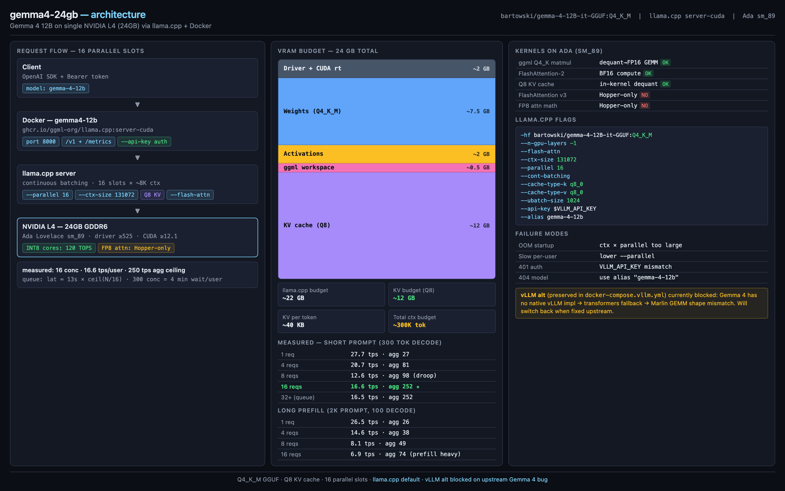

# gemma4-24gb



Gemma 4 12B on a single 24GB GPU (NVIDIA L4) via **llama.cpp** + Docker. Personal-use setup. Serves `bartowski/gemma-4-12B-it-GGUF:Q4_K_M`.

vLLM is the original target but currently blocked by an upstream Gemma 4 bug ([details](./ARCHITECTURE.md#vllm-alt-backend-blocked)). Compose preserved as `docker-compose.vllm.yml` for when fixed.

Deep dives: [ANALYSIS.md](./ANALYSIS.md) (decision rationale), [ARCHITECTURE.md](./ARCHITECTURE.md) (system + concurrency math).

## Prereqs

- NVIDIA GPU with 24GB+ VRAM (L4, A10G, RTX 4090, A100...)
- NVIDIA driver ≥525, CUDA ≥12.1
- Docker ≥24.x + Docker Compose v2
- NVIDIA Container Toolkit installed and configured
- HuggingFace account + Gemma 4 license accepted at https://huggingface.co/google/gemma-4-12B-it-qat-w4a16-ct (bartowski mirror also requires Google license accept)
- HF token (read scope) from https://huggingface.co/settings/tokens
- ~30GB free disk

Verify GPU toolkit:
```bash
docker run --rm --gpus all nvidia/cuda:12.1.0-base-ubuntu22.04 nvidia-smi
```

## Run

```bash
cp .env.example .env             # paste HF_TOKEN + generate VLLM_API_KEY
docker compose up -d
docker compose logs -f llama     # watch cold start (~5-10min GGUF download)
```

Wait for `HTTP server listening` (or similar) and `slot ... | init: prompt cache enabled`.

## Verify

```bash
curl http://localhost:8000/health

# /v1/* requires bearer
curl -H "Authorization: Bearer $VLLM_API_KEY" http://localhost:8000/v1/models
```

## Use

```bash
pip install -r requirements.txt
set -a; source .env; set +a       # load env vars into shell
python main.py
python main.py "Write a haiku about quantization."
```

## Concurrency tuning

Default = 16 slots × ~8K ctx (in `docker-compose.yml`). Edit `--parallel` + `--ctx-size` for other balances:

| Goal | `--parallel` | `--ctx-size` | Per-user tok/s |
|------|--------------|--------------|----------------|
| Low-latency long-ctx | 4 | 131072 | ~25-35 |
| Balanced | 8 | 131072 | ~15-25 |
| **Default (short-chat fleet)** | **16** | **131072** | **~7-12** |
| Max concurrent | 32 | 131072 | ~3-6 |

`--ctx-size` = **total** budget shared across slots, NOT per-slot. Per-slot avg = ctx-size / parallel.

300 concurrent on single L4 = **not viable** (~0.5 tok/s/user). See [ARCHITECTURE.md scaling path](./ARCHITECTURE.md#scaling-path-out-of-scope-documented).

## Metrics endpoint

llama.cpp exposes Prometheus metrics at `/metrics` (bearer auth required). Wire to your own Prometheus:

```yaml
# in your prometheus.yml
- job_name: llama
  metrics_path: /metrics
  authorization:
    credentials: "<VLLM_API_KEY>"
  static_configs:
    - targets: ['<host>:8000']
```

Useful metrics:
- `llamacpp:tokens_predicted_total` — decode tokens
- `llamacpp:prompt_tokens_total` — prefill tokens
- `llamacpp:requests_processing` — active slots
- `llamacpp:requests_deferred` — queued
- `llamacpp:n_busy_slots_per_decode` — batch fullness
- `llamacpp:n_tokens_max` — peak n_tokens (KV high-water proxy)

Verify endpoint:
```bash
curl -H "Authorization: Bearer $VLLM_API_KEY" http://localhost:8000/metrics | grep "^llamacpp"
```

GPU metrics: run `nvcr.io/nvidia/k8s/dcgm-exporter` separately if not already in your stack.

## Benchmark concurrency (built-in)

`bench` service in compose. Hidden behind profile (won't run on `up -d`):

```bash
# default levels: 1,4,8,16,32
docker compose --profile bench run --rm bench

# custom levels + prompt
CONCURRENCY_LEVELS=1,8,32 MAX_TOKENS=500 \
  docker compose --profile bench run --rm bench

# longer prompt for prefill cost
PROMPT="Write a detailed essay about quantization." MAX_TOKENS=800 \
  docker compose --profile bench run --rm bench
```

Output: per-concurrency table — wall clock, p50 latency, per-user tok/s (avg/min/max), aggregate tok/s.

Replace projected numbers in [ARCHITECTURE.md](./ARCHITECTURE.md) with measured.

## Stop / restart

```bash
docker compose down                       # stops; weights persist in volume
docker compose down -v                    # also drops volume (~7.5GB re-download)
docker compose restart llama
```

## Switch backends

```bash
# llama.cpp (default)
docker compose up -d

# vLLM (currently broken — Marlin shape bug on Gemma 4)
docker compose -f docker-compose.vllm.yml up -d
```

## Troubleshoot

| Symptom | Likely cause | Fix |
|---------|--------------|-----|
| `runtime: nvidia` error | Old Docker | Upgrade Docker ≥24, install nvidia-container-toolkit |
| 403 on GGUF download | Gemma license not accepted | Accept on Google's official HF model page |
| 401 on HF download | Invalid `HF_TOKEN` | Regenerate token (read scope) |
| OOM at startup | `--ctx-size` × `--parallel` too large | Lower one; verify Q8 KV active |
| 401 on `/v1/*` | Wrong `VLLM_API_KEY` in client | Confirm `.env` matches; reload shell env |
| 404 model name | Client passing wrong model | Use `gemma-4-12b` (matches `--alias`) |
| Slow per-user under load | Too many slots saturate compute | Reduce `--parallel` |
| Container restart loop | Check logs | `docker compose logs llama` |
| Cold start very slow | First-run GGUF download | ~7.5GB over EC2 network, ~5-10 min |

## Files

- `docker-compose.yml` — llama.cpp service (default) + `bench` profile
- `docker-compose.vllm.yml` — vLLM service (alt, currently broken upstream)
- `bench/run.py` — async concurrency benchmark
- `main.py` — minimal OpenAI-SDK client
- `requirements.txt` — `openai` only (host-side)
- `.env.example` — HF token + API key template
- `architecture.html` — interactive arch diagram source
- `docs/architecture.png` — rendered diagram
- `ANALYSIS.md` — runtime decision rationale
- `ARCHITECTURE.md` — VRAM math + concurrency matrix + vLLM addendum
- `PLAN.md` — original implementation plan
